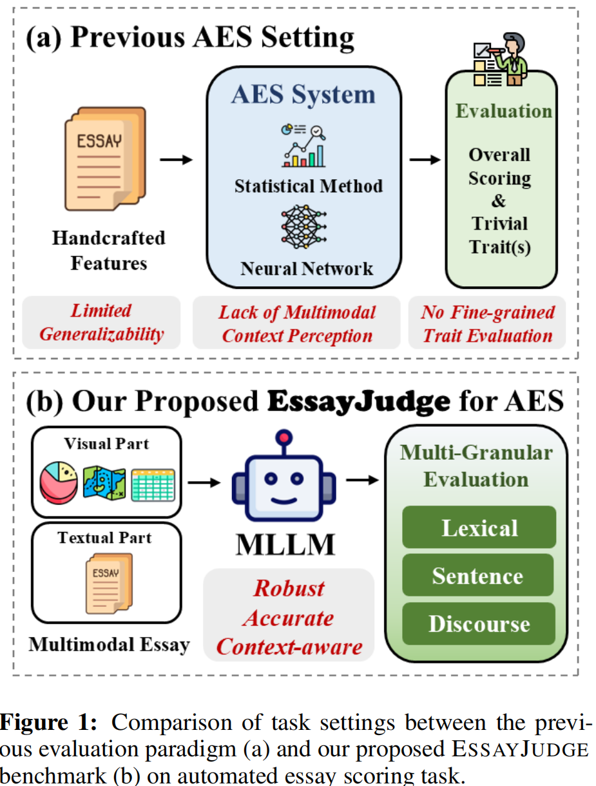
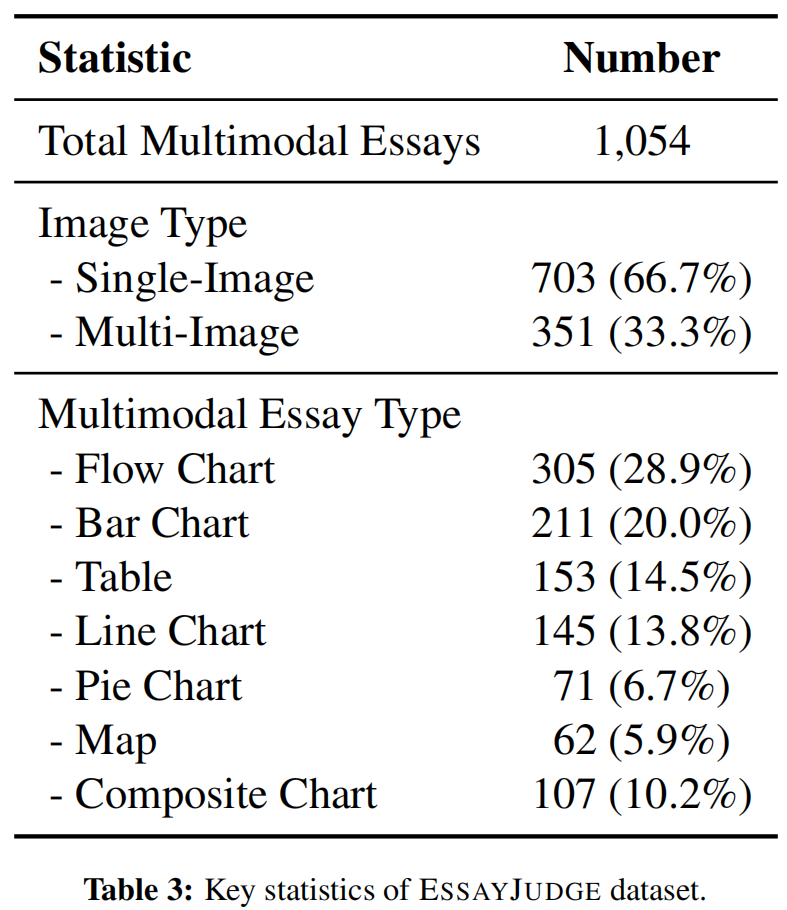
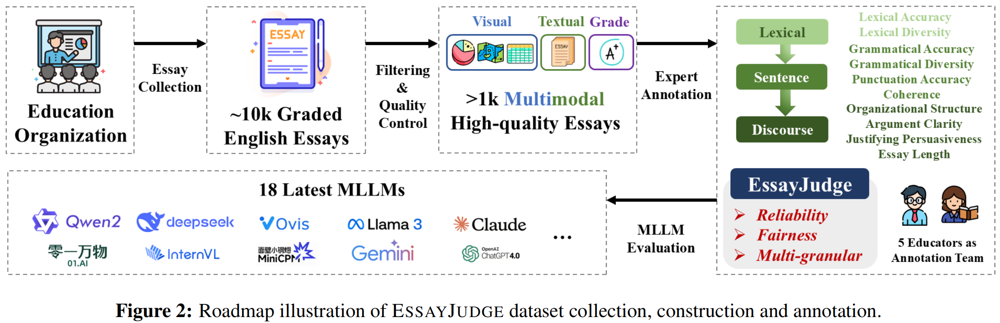
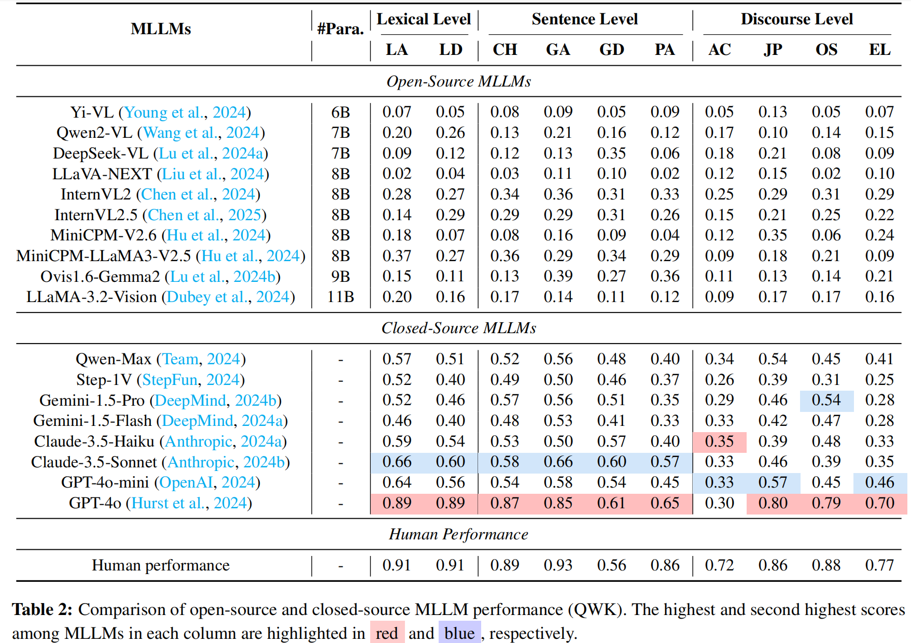
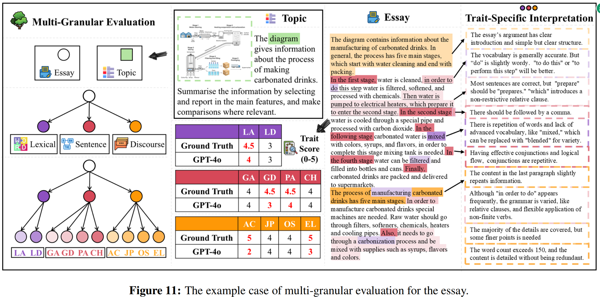

<div align=center>

</div> 
<h2 align="center">
<a href="https://arxiv.org/abs/2502.11916">EssayJudge: A Multi-Granular Benchmark for Assessing Automated Essay
Scoring Capabilities of Multimodal Large Language Models
</a></h2>
    
<h5 align="center"> If you like our project, please give us a star ⭐ on GitHub for the latest update.</h5>

<h5 align=center>

[](https://arxiv.org/abs/2502.11916)
[](./LICENSE)
</h5>

## 📣 News
* **[2025/5/16]** 🎉🎉🎉 EssayJudge has been accepted by ACL Findings 2025.
* **[2025/05/21]** 🚀 EssayJudge source code and dataset released!

## 🎯 Overview
## 🔍 What is EssayJudge?

We propose **EssayJudge**, the **first multimodal benchmark for assessing the multi-granular Automated Essay Scoring (AES) capabilities of Multimodal Large Language Models (MLLMs)**.

### ✨ Key Features

- ✅ **No handcrafted features**  
  Leverages MLLMs’ ability to capture complex linguistic and contextual patterns automatically.

- ✅ **Multi-granular trait modeling**  
  Supports fine-grained evaluation at lexical-, sentence-, and discourse-levels.

- ✅ **Multimodal input support**  
  Accepts both textual and visual inputs (e.g., image-enhanced prompts), making it suitable for evaluating essays with complex visual contexts.
  
<div style="text-align: center;">
  
  
</div>


<div style="text-align: center;">
  
</div>


<div style="text-align: center;">
  
</div>

<div style="text-align: center;">
  
</div>
We envision that ESSAYJUDGE will not only drive innovation in AES but also serve as a stepping stone toward broader applications of MLLMs in educational assessment and beyond. The research community can address the challenges identified
and foster the development of more accurate and interpretable AES systems towards AGI.

## 🕹️ Usage

Follow the steps below to run your own evaluation using the EssayJudge benchmark.

---

### 1. Install Dependencies

Make sure you are in the project root directory and install required packages:

```bash
pip install -r requirements.txt
```
### 2. Set the Input and output File Path

Make sure the input CSV file path in your script (e.g., `closed_source.py` or `QWK.py`) points to the provided `data.csv` file in the project root.
Update the following line in the script:
```python
data = pd.read_csv("data.csv")
```

### 3. Run the Evaluation Script

#### 🔐 For Closed-source Models

Run the following command to evaluate closed-source models (e.g., GPT-4o, etc.):

```bash
python code/Closed_source/closed_source.py
```
Before running, you must manually fill in your own API key and model name in the `closed_source.py` script.

#### 🧠 For Open-source Models

After downloading the required model weights (e.g., from Hugging Face), run the corresponding script inside each model's folder. For example:

```bash
python code/Open_source/internvl/run_internvl.py
```
Each subfolder under `code/Open_source/ (e.g., deepseekvl_7b, llava_next, qwen_vl, etc.)` contains its own script for inference.

Make sure to:

✅ Download and place the model weights in the expected path;

✅ Modify the script if needed to point to data.csv;

✅ Run the script in a properly configured environment with GPU support.

EssayJudge evaluates each essay across the following 10 fine-grained traits, spanning lexical, syntactic, structural, and discourse levels:

📌 Note: Throughout the `.py` scripts and CSV files in this project, trait names are referred to by their abbreviations for clarity and compactness. The mapping is as follows:

| Abbreviation | Full Trait Name            |
|--------------|----------------------------|
| **AC**       | Argument Clarity           |
| **JP**       | Justifying Persuasiveness  |
| **OS**       | Organizational Structure   |
| **CH**       | Coherence                  |
| **EL**       | Essay Length               |
| **GA**       | Grammatical Accuracy       |
| **GD**       | Grammatical Diversity      |
| **LA**       | Lexical Accuracy           |
| **LD**       | Lexical Diversity          |
| **PA**       | Punctuation Accuracy       |

### 4. Compute QWK Scores

After the predictions are generated and saved to a CSV file, use the QWK evaluation script to compare model outputs against ground truth scores.

```bash
python code/QWK/QWK.py
```
This script computes Quadratic Weighted Kappa (QWK) scores for each of the 10 traits and outputs a summary file in CSV format.

#### You can now explore how different models perform across fine-grained, multi-level traits in multimodal essay scoring tasks. 🎉

## ✏️ Citation
If you find this paper useful, please consider staring 🌟 this repo and citing 📑 our paper:
```
@misc{su2025essayjudgemultigranularbenchmarkassessing,
      title={EssayJudge: A Multi-Granular Benchmark for Assessing Automated Essay Scoring Capabilities of Multimodal Large Language Models}, 
      author={Jiamin Su and Yibo Yan and Fangteng Fu and Han Zhang and Jingheng Ye and Xiang Liu and Jiahao Huo and Huiyu Zhou and Xuming Hu},
      year={2025},
      eprint={2502.11916},
      archivePrefix={arXiv},
      primaryClass={cs.CL},
      url={https://arxiv.org/abs/2502.11916}, 
}
```
